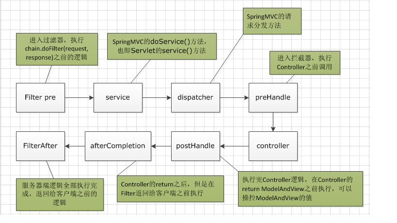

## 1、java 反射是怎么回事？

**反射是框架设计的灵魂（使用的前提条件：必须先得到代表的字节码的Class，Class类用于表示.class文件（字节码））**

### 1.反射的概述

Java反射机制是在运行状态中，对于任意一个类，都能够知道这个类的所有属性和方法；对于任意一个对象，都能够调用它的任意一个方法和属性；这种动态获取类的信息以及动态调用对象的方法的功能称为java语言的反射机制。

要想解剖一个类，必须先要获取到该类的字节码文件对象。而解剖使用的就是Class类中的方法，所以先要获取到每一个字节码文件对应的Class类型的对象。


**以上的总结就是什么是反射**

反射就是把java类中的各种成分映射成一个个的Java对象

例如：一个类有：成员变量、方法、构造方法、包等等信息，利用反射技术可以对一个类进行解剖，把个个组成部分映射成一个个对象。

​     （其实：一个类中这些成员方法、构造方法、在加入类中都有一个类来描述）

如图是类的正常加载过程：反射的原理在与class对象。

熟悉一下加载的时候：Class对象的由来是将class文件读入内存，并为之创建一个Class对象。


### 2. 查看Class类在java中的api详解（1.7的API）

`Class` 类的实例表示正在运行的 Java 应用程序中的类和接口。也就是jvm中有N多的实例每个类都有该Class对象。（包括基本数据类型）

`Class` 没有公共构造方法。`Class` 对象是在加载类时由 Java 虚拟机以及通过调用类加载器中的`defineClass` 方法自动构造的。也就是这不需要我们自己去处理创建，JVM已经帮我们创建好了。


### 3.反射的使用

#### 1.获取Class对象的三种方式

1. **Object  -----> getClass();**
2. **任何数据类型（包括基本数据类型）都有一个“静态”的class属性**
3. **通过Class类的静态方法：forName（String  className）(常用)**

**1.Object  -----> getClass();****

因为Object类中的getClass方法、因为所有类都继承Object类。从而调用Object类来获取。

~~~java
//第一种方式获取Class对象    
        Student stu1 = new Student();//这一new 产生一个Student对象，一个Class对象。  
        Class stuClass = stu1.getClass();//获取Class对象  
~~~

**2.任何数据类型（包括基本数据类型）都有一个“静态”的class属性**

~~~java
 Class stuClass2 = Student.class;  
 System.out.println(stuClass == stuClass2);//判断第一种方式获取的Class对象和第二种方式获取的是否是同一个  
~~~

**3.通过Class类的静态方法：forName（String  className）(常用)**

~~~java
 try {  
            Class stuClass3 = Class.forName(”fanshe.Student”);//注意此字符串必须是真实路径，就是带包名的类路径，包名.类名  
            System.out.println(stuClass3 == stuClass2);//判断三种方式是否获取的是同一个Class对象  
        } catch (ClassNotFoundException e) {  
            e.printStackTrace();  
        }  
~~~

三种方式常用第三种，第一种对象都有了还要反射干什么。第二种需要导入类的包，依赖太强，不导包就抛编译错误。一般都第三种，一个字符串可以传入也可写在配置文件中等多种方法。


**注意：在运行期间，一个类，只有一个Class对象产生。****


#### 2. 通过反射获取构造方法并使用：

1. 获取构造方法：

   1).批量的方法：
   public Constructor[] getConstructors()：所有”公有的”构造方法
    public Constructor[] getDeclaredConstructors()：获取所有的构造方法(包括私有、受保护、默认、公有)
        
     2).获取单个的方法，并调用：
   public Constructor getConstructor(Class… parameterTypes):获取单个的”公有的”构造方法：
   public Constructor getDeclaredConstructor(Class… parameterTypes):获取”某个构造方法”可以是私有的，或受保护、默认、公有；

2. 调用构造方法：

   使用此 `Constructor` 对象表示的构造方法来创建该构造方法的声明类的新实例，并用指定的初始化参数初始化该实例。

   它的返回值是T类型，所以newInstance是创建了一个构造方法的声明类的新实例对象。并为之调用

~~~java
 Constructor con = clazz.getConstructor(null);  
        //1>、因为是无参的构造方法所以类型是一个null,不写也可以：这里需要的是一个参数的类型，切记是类型 
        //2>、返回的是描述这个无参构造函数的类对象。       
        System.out.println(”con = ” + con);  
        //调用构造方法  
        Object obj = con.newInstance();  
    //  System.out.println(“obj = ” + obj);  
    //  Student stu = (Student)obj;  
          
        System.out.println(”******************获取私有构造方法，并调用*******************************”);  
        con = clazz.getDeclaredConstructor(char.class);  
        System.out.println(con);  
        //调用构造方法  
        con.setAccessible(true);//暴力访问(忽略掉访问修饰符)  
        obj = con.newInstance(’男’);  
~~~


#### 3、获取成员变量并调用

​	**获取时不分是否是静态变量**

1. 批量的

   1).Field[] getFields():获取所有的"公有字段"

   2).Field[] getDeclaredFields():获取所有字段，包括：私有、受保护、默认、公有；

2. 获取单个的：

   1).public Field getField(String fieldName):获取某个"公有的"字段；

   2).public Field getDeclaredField(String fieldName):获取某个字段(可以是私有的)

3. 设置字段的值：

   Field --> public void set(Object obj,Object value):

   参数说明：

   ​	1.obj:要设置的字段所在的对象；

   ​	2.value:要为字段设置的值；

~~~java
Field f = stuClass.getField("name");
System.out.println(f);
//获取一个对象
 Object obj = stuClass.getConstructor().newInstance();//产生Student对象--》Student stu = new Student();
//为字段设置值
f.set(obj, "刘德华");//为Student对象中的name属性赋值--》stu.name = "刘德华"
 //验证
Student stu = (Student)obj;
System.out.println("验证姓名：" + stu.name);
~~~


#### 4、获取成员方法并调用

1. 批量的：

public Method[] getMethods():获取所有"公有方法"；（包含了父类的方法也包含Object类）

public Method[] getDeclaredMethods():获取所有的成员方法，包括私有的(不包括继承的)

2. 获取单个的：

public Method getMethod(String name,Class<?>... parameterTypes):

public Method getDeclaredMethod(String name,Class<?>... parameterTypes)

​	参数：

​				name : 方法名；

​				Class ... : 形参的Class类型对象

3. 调用方法：

   Method --> public Object invoke(Object obj,Object... args):

   参数说明：

   obj : 要调用方法的对象；

   args:调用方式时所传递的实参；

~~~java
Method m = stuClass.getMethod("show1", String.class);
System.out.println(m);
//实例化一个Student对象
Object obj = stuClass.getConstructor().newInstance();
m.invoke(obj, "刘德华");
~~~

#### 5、 反射main方法

~~~java
try {
//1、获取Student对象的字节码
Class clazz = Class.forName("fanshe.main.Student");
//2、获取main方法
Method methodMain = clazz.getMethod("main", String[].class);//第一个参数：方法名称，第二个参数：方法形参的类型，
//3、调用main方法
// methodMain.invoke(null, new String[]{"a","b","c"});
//第一个参数，对象类型，因为方法是static静态的，所以为null可以，第二个参数是String数组，这里要注意在jdk1.4时是数组，jdk1.5之后是可变参数
//这里拆的时候将  new String[]{"a","b","c"} 拆成3个对象。。。所以需要将它强转。
methodMain.invoke(null, (Object)new String[]{"a","b","c"});//方式一
// methodMain.invoke(null, new Object[]{new String[]{"a","b","c"}});//方式二

} catch (Exception e) {
e.printStackTrace();
}
~~~


#### 6、反射方法的其它使用之一通过反射运行配置文件内容

~~~java
/*
 * 我们利用反射和配置文件，可以使：应用程序更新时，对源码无需进行任何修改
 * 我们只需要将新类发送给客户端，并修改配置文件即可
 */
public class Demo {
    public static void main(String[] args) throws Exception {
        //通过反射获取Class对象
        Class stuClass = Class.forName(getValue("className"));//"cn.fanshe.Student"
        //2获取show()方法
        Method m = stuClass.getMethod(getValue("methodName"));//show
        //3.调用show()方法
        m.invoke(stuClass.getConstructor().newInstance());

    }

    //此方法接收一个key，在配置文件中获取相应的value
    public static String getValue(String key) throws IOException{
        Properties pro = new Properties();//获取配置文件的对象
        FileReader in = new FileReader(System.getProperty("user.dir")+"\\src\\cn\\wannengde\\reflect\\pro.txt");//获取输入流
        pro.load(in);//将流加载到配置文件对象中
        in.close();
        return pro.getProperty(key);//返回根据key获取的value值
    }
}
~~~


#### 7、反射方法的其它使用之—通过反射越过泛型检查

泛型用在编译期，编译过后泛型擦除（消失掉）。所以是可以通过反射越过泛型检查的

~~~java
import java.lang.reflect.Method;
import java.util.ArrayList;

/*
 * 通过反射越过泛型检查
 * 
 * 例如：有一个String泛型的集合，怎样能向这个集合中添加一个Integer类型的值？
 */
public class Demo {
    public static void main(String[] args) throws Exception{
        ArrayList<String> strList = new ArrayList<>();
        strList.add("aaa");
        strList.add("bbb");

    //  strList.add(100);
        //获取ArrayList的Class对象，反向的调用add()方法，添加数据
        Class listClass = strList.getClass(); //得到 strList 对象的字节码 对象
        //获取add()方法
        Method m = listClass.getMethod("add", Object.class);
        //调用add()方法
        m.invoke(strList, 100);

        //遍历集合
        for(Object obj : strList){
            System.out.println(obj);
        }
    }
}
~~~


## 2、过滤器和拦截器的区别

	### 1.过滤器和拦截器的区别

1. 过滤器是基于函数回调，而拦截器是基于java的反射机制的。
2. 过滤器依赖与servlet，拦截器不依赖与servlet容器。
3. 过滤器则可以对几乎所有的请求起作用，拦截器只能对action请求起作用。
4. 过滤器不能访问action上下文、值栈的对象，而拦截器可以。
5. 在action的生命周期中，拦截器可以多次被调用，而过滤器只能在容器初始化时被调用一次。
6. ==拦截器可以获取IOC容器中的各个bean，而过滤器就不行，这点很重要，在拦截器里注入一个service,可以调用业务逻辑。==


### 2.触发时机

1. ==过滤器和拦截器触发时机不一样：==

   ​		==过滤器时在请求进入容器后，但请求进入servlet之前进行预处理的。请求结束返回也是，实在servlet处理完后返回给前端之前。==

   

   **总结:过滤器包裹住servlet,servlet包裹住拦截器。**


2. 过滤器的触发时机是容器后，serlvert之前，所以过滤器的doFilter(ServletRequest request, ServletResponse response, FilterChain chain)的入参是ServletRequest，而不是httpServletRequest,因为过滤器是在httpServlet之前。


### 3.过滤器

1. **过滤器是javaEE标准，采用函数回调的方式进行**。是在请求进入容器之后，还未进入Servlet之前进行预处理，并且在请求结束返回给前端这之间进行后期处理。

~~~java
@Override
    public void doFilter(ServletRequest request, ServletResponse response, FilterChain chain) throws IOException, ServletException {
        System.out.println("before...");
        chain.doFilter(request, response);
        System.out.println("after...");
    }
~~~

chain.doFilter(request,response);这个方法的调用作为分水岭。事实上调用Servlet的doService()方法是在chain.doFilter(request,response)这个方法中进行的。


2. **拦截器是被包裹在过滤器之中的。**

~~~java
@Override
    public boolean preHandle(HttpServletRequest request, HttpServletResponse response, Object handler) throws Exception {
        System.out.println("preHandle");
        return true;
    }

    @Override
    public void postHandle(HttpServletRequest request, HttpServletResponse response, Object handler, ModelAndView modelAndView) throws Exception {
        System.out.println("postHandle");
    }

    @Override
    public void afterCompletion(HttpServletRequest request, HttpServletResponse response, Object handler, Exception ex) throws Exception {
        System.out.println("afterCompletion");
    }
~~~

- preHandle()这个方法是在过滤器的chain.doFilter(request, response)方法的前一步执行，也就是在 [System.out.println("before...")][chain.doFilter(request, response)]之间执行。
- preHandle()方法之后，在return ModelAndView之前进行，可以操控Controller的ModelAndView内容。
- afterCompletion()方法是在过滤器返回给前端前一步执行，也就是在[chain.doFilter(request, response)][System.out.println("after...")]之间执行。


3. ==**SpringMVC的机制是由同一个Servlet来分发请求给不同的Controller,其实这一步是在Servlet的service()方法中执行的。**==所以过滤器、拦截器、service()方法，dispatcher()方法的执行顺序如图。




**总结：**拦截器功在对请求权限鉴定方面确实很有用处。

Spring的拦截器与Servlet的Filter有相似之处，比如二则都是AOP编程思想的体现，都能实现权限检查、日志记录。不同的是：

- 使用范围不同：Filter是Servlet规范规定的，只能用于Web程序中。而拦截器既可以用于Web程序，也可以用于Application、Swing程序中。
- 规范不同：Filter是在Servlet规范中定义的，是Servlet容器支持的。而拦截器是在Spring容器内的，是Spring框架支持的。
- 使用的资源不同：同其他的代码块一样，拦截器也是一个Spring的组件，归Spring管理，配置在Spring文件中，因此能使用Spring里的任何资源、对象，例如Service对象、数据源、事务管理等，通过IOC注入到拦截器即可；而Filter则不能。
- 深度不同：Filte在只在Servlet前后起作用，而拦截器能够深入到方法前后、异常抛出前后等，因此拦截器的使用具有更大的弹性。所以在Spring构架的程序中，要优先使用拦截器。


## 3、ServletRequest,HttpServletRequest ，Request的区别

1. servlet理论上可以处理多种形式的请求响应形式,http只是其中之一，所以HttpServletRequest、HttpServletRespone分别是ServletRequest和ServletRespone的子类。

2.  HttpServletRequest和ServletRequest都是接口，HttpServletRequest继承自ServletRequest。

   HttpServletRequest比ServletRequest多了一些针对于Http协议的方法。如getHeader (String name)， getMethod () ，getSession () 等等。

   他们对应的实现类：

   ```java
   javax.servlet.ServletRequestWrapper (implements javax.servlet.ServletRequest)
       
   javax.servlet.http.HttpServletRequestWrapper (implements javax.servlet.http.HttpServletRequest)
   ```

3. 而所谓的request（在JSP中使用的）其实只是规范中的一个名称而已。它当然是一个对象，但并不是SUN提供的，这是由各个不同的Servlet提供商编写的，SUN只是规定这个类要实现HttpServletRequest接口，并且规定了各个方法的用途，但具体是什么类是由各个提供商自己决定的。


## 4、Web容器、Servlet容器、Spring容器、SpringMVC容器之间的关系

### 1.web容器

- Web容器（Web服务器）：负责管理和部署web应用，其本身可能具备servlet容器组件；如果没有，一般能将第三方servlet容器作为组件整合进web容器。

- 没有servlet容器，可以用Web容器直接访问静态页面，但如果要显示jsp/servlet，你就要安装一个servlet容器，但是光有servlet容器是不够的，因为它需要被解析成html输出，所以你仍需要一个web容器。大多数servlet容器同时提供了web容器的功能，也就是说大多数servlet容器可以独立运行你的web应用。
- **web容器是管理servlet(通过servlet容器)，以及监听器（Listener）和过滤器（Filter）的。**这些都是在web容器的掌控范围里。但他们不在spring和springMVC的掌控范围里。因此，我们无法在这些类中直接使用Spring注解的方式来注入我们需要的对象，是无效的,web容器是无法识别的。

### 2. Servlet容器

- **servlet容器是管理servlet对象的。**
- servlet容器的作用：负责处理客户请求，当客户请求来到时，Servlet容器获取请求，然后调用某个Servlet，并把Servlet的执行结果返回给客户。
- 使用Servlet容器的原因：
  - 通信支持：利用容器提供的方法，能轻松的让servlet与web服务器对话，而不用自己建立serversocket、j监听某个端口、创建流等等。容器知道自己与web服务器之间的协议，所以你的servlet不用担心web服务器（如Apache）和你自己的web代码之间的API,只需要考虑如何在servlet中实现业务逻辑（如处理一个订单）。
  - 生命周期管理：servlet容器控制这servlet的生与死，它负责加载类、实例化和初始化servlet，调用servlet方法，以及使servlet实例被垃圾回收，有了servlet容器，你不需要太多的考虑资源管理。
  - 多线程支持：容器会自动为它所接收的每个servlet请求创建一个新的java线程。针对用户的请求，如果servlet已经运行完相应的http服务方法，这个线程就会结束。这并不是说你不需要考虑线程安全性，其实你还会遇到同步问题，不过这样能使你少做很多工作。
  - 声明方式实现安全：利用serlvet容器，可以使用xml部署描述文件来配置和修改安全性，而不必将其硬编码写到servlet类代码中。
  - JSP支持：servlet容器负责将jsp代码翻译为真正的java代码。


### 3.Spring容器和SpringMVC容器

- Spring容器：Spring容器是管理service和dao的。
- SpringMVC容器：SpringMVC容器是管理controller对象的。
- Spring容器和SpringMVC容器的关系是父子容器的关系。Spring容器是父容器，SpringMVC容器是子容器。在子容器里可以访问父容器里的对象，但是在父容器里不可以访问子容器的对象，说的通俗点就是，在controller里可以访问service对象，但是在service里不可以访问controller对象。所以这么看的话，所有的bean，都是被Spring或者SpringMVC容器管理的，他们可以直接注入。然后SpringMVC的拦截器也是SpringMVC容器管理的，所以在SpringMVC的拦截器里，可以直接注入bean对象。


### 4.**Servlet容器和ServletContext的关系：**

ServletContext是servlet与servlet容器之间的直接通信的接口。Servlet容器在启动一个Web应用时，会为它创建一个servletContext对象。每个web应用有唯一的servletContext对象。同一个web应用的所有servlet对象共享一个serveltContext,servlet对象可以通过它来访问容器中的各种资源。


## 5、JAVA中集合有序与无序集合的区别？

### 1.有序与无序的意义

有序、无序是指在进行插入操作时，插入位置的顺序性先插的位置在前，后插的位置在后，则为有序，反之无序。

而大家容易混淆的就是排序，排序是指集合内的元素是否按照升序或降序来排序。


### 2.大致区分

1. 有序集合：集合里的元素可以根据key或index访问 
   无序集合：集合里的元素只能遍历。 
   有序集合在属性的增加，删除及修改中拥有较好的性能表现。

2. 无序集： Set 
   有序集： List 

   所以，凡是实现

   set的AbstractSet, CopyOnWriteArraySet, EnumSet, HashSet, JobStateReasons, LinkedHashSet, TreeSet 
   都是无序的，但是TreeSet排序；

   凡是实现List的 
   AbstractList, AbstractSequentialList, ArrayList, AttributeList, CopyOnWriteArrayList, LinkedList, RoleList, RoleUnresolvedList, Stack, Vector 
   都是有序的 ；


   对于补充 
   Map是根据key来存储的 

   所以，从这个角度来讲，是有序的


## 6、重写equals方法的时候为什么需要重写hashcode？

[参考文档](https://www.jianshu.com/p/75d9c2c3d0c1)

**总结：在重写equals方法的时候，一定要重写hashCode方法。有这个要求的症结在于，要考虑到类似HashMap、HashTable、HashSet的这种散列的数据类型的运用。**

首先有下面几个概念要知道：

### 1.equals()方法

Java的Object.equals()方法：

~~~java
public boolean equals(Object object){
      return(this == obj);
}
~~~

可以看到这里直接用' == '来直接比较，引用《Java编程思想》里的一句话：“关系操作符生成的是一个boolean结果，它们计算的是操作数的值之间的关系”。那么' == '比较的值到底是什么呢？
  我们知道Java有8种基本类型：数值型（byte、short、int、long、float、double）、字符型（char）、布尔型（boolean），**对于这8种基本类型的比较，变量存储的就是值，所以比较的就是'值'本身**。如下，值相等就是true，不等就是false。

对于非基本类型，也就是常说的引用数据类型：类、接口、数组，**由于变量种存储的是内存中的地址，并不是'值'本身，所以真正比较的是该变量存储的地址**，可想而知，如果声明的时候是2个对象，地址固然不同。

**Object中的equals方法是直接比较的地址**，因为Object类是所有类的基类，所以调用新创建的类的equals方法，比较的就是两个对象的地址。

**equals()方法实现了等价关系**，即实现equals方法的基本要求：

自反性：对于任何非空引用x，x.equals(x)应该返回true；

对称性：对于任何引用x和y，如果x.equals(y)返回true，那么y.equals(x)也应该返回true；

传递性：对于任何引用x、y和z，如果x.equals(y)返回true，y.equals(z)返回true，那么x.equals(z)也应该返回true；

一致性：如果x和y引用的对象没有发生变化，那么反复调用x.equals(y)应该返回同样的结果；

非空性：对于任意非空引用x，x.equals(null)应该返回false；


### 2.hashCode()方法

此方法返回对象的哈希码值，什么是哈希码？度娘找到的相关定义：

> 哈希码产生的依据：哈希码并不是完全唯一的，它是一种算法，让同一个类的对象按照自己不同的特征尽量的有不同的哈希码，但不表示不同的对象哈希码完全不同。也有相同的情况，看程序员如何写哈希码的算法。

简单理解就是一套算法算出来的一个值，且这个值对于这个对象相对唯一。哈希算法有一个协定：在 Java 应用程序执行期间，在对同一对象多次调用 hashCode 方法时，必须一致地返回相同的整数，*前提是将对象进行hashcode比较时所用的信息没有被修改*。（ps：要是每次都返回不一样的，就没法玩儿了）


### 3.HashMap等散列数据结构的原理

简单说下HashMap的原理，**HashMap存储数据的时候，是取的key值的哈希值，然后计算数组下标，采用链地址法解决冲突，然后进行存储；取数据的时候，依然是先要获取到hash值，找到数组下标，然后for遍历链表集合，进行比较是否有对应的key(就是调用equals方法)。比较关心的有2点：*1.*不管是put还是get的时候，都需要得到key的哈希值，去定位key的数组下标； *2.*在get的时候，需要调用equals方法比较是否有相等的key存储过。**